# fit_sensex Runtime Flow

```mermaid
flowchart TD
    A["Start app"] --> B["Select underlying and expiry"]
    B --> C["Load workbook inputs from hols.xlsx
variables / params / full_days"]
    C --> D["Fetch instruments and option tokens from Kite"]
    D --> E["Start websocket stream"]

    E --> F["Background tick updates
latest CE/PE bid-ask by strike"]

    F --> G["GUI refresh cycle"]
    G --> H["Take snapshot of latest market store"]
    H --> I["Compute synthetic bid / ask by strike"]
    I --> J["Find best synthetic bid / ask
near user value"]
    J --> K["Compute universal mid and universal spot"]
    K --> L["Compute market IV bid / ask / mid"]
    L --> M["Interpolate ATM vol"]
    M --> N["Compute normalized strikes and slopes"]
    N --> O["Fit parametric vol curve"]
    O --> P["Write fitted IV model back to rows"]

    P --> Q["Load portfolio file"]
    Q --> R["Split books: options and delta"]
    R --> S["Compute risk rows and greeks"]
    S --> T["Check combined delta vs threshold"]
    T --> U{"Threshold breached?"}
    U -- "No" --> V["Update Risk / Hedge Trades / PnL tabs"]
    U -- "Yes" --> W["Resize synthetic delta hedge"]
    W --> X["Write hedge trade to trades file"]
    X --> V

    V --> Y["Render all tabs"]
    Y --> Z["Wait refresh_ms"]
    Z --> G
```

## Plain-English cycle

1. The app starts and asks for:
   - underlying (`SENSEX` or `NIFTY`)
   - expiry

2. It loads workbook-driven inputs from `hols.xlsx`:
   - variables
   - initial fit params
   - `full_days`

3. It fetches the matching option instruments/tokens from Kite and starts the websocket.

4. The websocket runs continuously in the background and keeps updating the latest:
   - CE bid/ask
   - PE bid/ask
   for each strike.

5. On every GUI refresh:
   - the app takes a snapshot of the latest prices
   - computes synthetic prices
   - computes universal mid / universal spot
   - computes market IVs
   - interpolates ATM vol
   - fits the parametric vol curve

6. Using that same refresh snapshot, the app then:
   - loads the portfolio
   - computes `options` and `delta` book risk
   - checks hedge threshold
   - adjusts synthetic hedge if needed
   - writes new hedge trades to the trades file if a hedge occurs

7. Then it updates:
   - Option Chain
   - Slope Plot
   - Normal Vol Surface
   - Error Surface
   - Cash Vol Surface
   - Risk
   - Hedge Trades
   - PnL

8. After `refresh_ms`, the cycle repeats.

## Important architecture note

The websocket and the GUI refresh are separate:

- websocket: updates market prices continuously
- GUI refresh: periodically consumes the latest snapshot and recomputes analytics/risk/UI

So the app is effectively:

`continuous market updates` + `periodic calculation/render loop`
